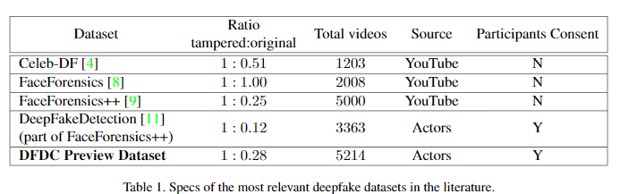

# fake-face-detection
some collected paper and personal notes relevant to Fake Face Detetection 

## Challenge

- [Facebook] [Deepfake Detection Challenge]( https://www.kaggle.com/c/deepfake-detection-challenge/overview )
  - [unofficial github repo](https://github.com/drbh/deepfake-detection-challenge)

## Study

1. [arXiv 2019] [Deep Learning for Deepfakes Creation and Detection](https://arxiv.org/abs/1909.11573)
2. [ACM SIGSAC 2019] [Poster: Towards Robust Open-World Detection of Deepfakes](https://dl.acm.org/citation.cfm?doid=3319535.3363269)

## I. Dataset

1. [FaceForensics++ Dataset](https://github.com/ondyari/FaceForensics/tree/master/dataset)

   - [benchmark](http://kaldir.vc.in.tum.de/faceforensics_benchmark)
   - [paper](https://arxiv.org/abs/1901.08971):  [ICCV 2019] FaceForensics++: Learning to Detect Manipulated Facial Images
     - 977 downloaded videos from youtube, 1000 original extracted sequences and its manipulated version
     - generated based on *Deep-Fakes, Face2Face, FaceSwap and NeuralTextures*  
   
2. [Google] [DeepFakeDetection Dataset](https://github.com/ondyari/FaceForensics/tree/master/dataset)
   
   - [homepage](https://ai.googleblog.com/2019/09/contributing-data-to-deepfake-detection.html)
     - over 363 original sequences from 28 paid actors in 16 different scenes
     - over 3000 manipulated videos using *Deep-Fakes*.
   
3. [DeepFake Forensics (Celeb-DF) Dataset](http://www.cs.albany.edu/~lsw/celeb-deepfakeforensics.html)
   
   - [paper](https://arxiv.org/abs/1909.12962): [arXiv 2019] Celeb-DF: A New Dataset for DeepFake Forensics
     - real and *DeepFake* synthesized videos having similar visual quality on par with those circulated online 
     - 408 original videos collected from YouTube with subjects of different ages, ethic groups and genders, and 795 DeepFake videos synthesized from these real videos. 
   
4.  [Facebook] [Deepfake Detection Challenge (DFDC) Dataset]( https://www.kaggle.com/c/deepfake-detection-challenge/data )

   - [paper](https://arxiv.org/abs/1910.08854) : [arXiv 2019] The Deepfake Detection Challenge (DFDC) Preview Dataset

     - consisting of 5K videos featuring two facial modification algorithms. 

     - a set of specific metrics to evaluate the performance have been defined and two existing models for detecting deepfakes have been tested to provide a reference perfor-mance baseline.

       

5. [TAMFA (Tampered face)  Dataset](https://www.sciencedirect.com/science/article/pii/S0957417419302350?via%3Dihub) 

   - [paper](https://www.sciencedirect.com/science/article/pii/S0957417419302350): [Expert Systems With Applications 2019] Face image manipulation detection based on a convolutional neural network
     - 8,950 facial images with unconstrained conditions such as pose, background cluttered, illumination change
     - 1,500 images labeled as “fake” and 7,450 images labeled as “normal”. 

6. [SwapMe and FaceSwap Dataset](https://www.sciencedirect.com/science/article/pii/S0957417419302350?via%3Dihub) 

   - [paper](https://www.semanticscholar.org/paper/Two-Stream-Neural-Networks-for-Tampered-Face-Zhou-Han/5c04b3178af0cc5f367c833030c118701c210229#paper-header): [CVPRW 2017] Two-Stream Neural Networks for Tampered Face Detection
     - generated by using one iOS application called *SwapMe* and an open source face swap application called *FaceSwap* 
     - contains 705 fake faces and 1,400 normal faces 

7. Deep Fakes Dataset
   - [to be released]
   - [paper](https://arxiv.org/abs/1901.02212): [arXiv 2019] FakeCatcher: Detection of Synthetic Portrait Videos using Biological Signals
     - more ''in the wild" portrait videos
     - totaling up to 142 videos,  32 minutes, and 30 GBs 
   
8. [Fake Faces in the Wild (FFW) Dataset](http://ali.khodabakhsh.org/research/ffw/)

   - [paper](https://ieeexplore.ieee.org/document/8553251): [BIOSIG 2018] Fake Face Detection Methods: Can They Be Generalized?
     - more than 53,000 images (from 150 videos)

9.  Swapped Face Detection Dataset

   - [to be released]
   - [paper](https://arxiv.org/abs/1909.04217): [arXiv 2019] Swapped Face Detection using Deep Learning and Subjective Assessment
     - A public dataset comprising 86 celebrities using 420,053 images.
     - This dataset is created using still images, different from other datasets created using video frames that may contain highly correlated images. 

## II. Current Work

### (1) Special Artifact-Based

1. [CVPRW 2019] [Protecting World Leaders Against Deep Fakes](http://openaccess.thecvf.com/content_CVPRW_2019/papers/Media%20Forensics/Agarwal_Protecting_World_Leaders_Against_Deep_Fakes_CVPRW_2019_paper.pdf)
   - [note](https://github.com/592McAvoy/fake-face-detection/blob/master/detect.md#cvprw-2019-protecting-world-leaders-against-deep-fakes);
   - capture the **distinct facial expression and movements of a specific person** use Action Unit (AU)
2. [CVPRW 2019] [Exposing DeepFake Videos By Detecting FaceWarping Artifacts](https://arxiv.org/abs/1811.00656)
   - [code](https://github.com/danmohaha/CVPRW2019_Face_Artifacts); [note](https://github.com/592McAvoy/fake-face-detection/blob/master/detect.md#cvprw-2019-exposing-deepfake-videos-by-detecting-facewarping-artifacts);
   - improved version: [DSP-FWA](https://github.com/danmohaha/DSP-FWA)
   - current generated face have **limited resolutions** 
3. [WIFS 2018] [In Ictu Oculi: Exposing AI Created Fake Videos by Detecting Eye Blinking](https://arxiv.org/abs/1806.02877)
   - [code](https://github.com/danmohaha/WIFS2018_In_Ictu_Oculi); [note](https://github.com/592McAvoy/fake-face-detection/blob/master/detect.md#wifs-2018-in-ictu-oculi-exposing-ai-created-fake-videos-by-detecting-eye-blinking); 
   - The **lack of eye blinking** indicates a synthesized video
4. [ICASSP 2019] [EXPOSING DEEP FAKES USING INCONSISTENT HEAD POSES](https://arxiv.org/abs/1811.00661)
   - [note](https://github.com/592McAvoy/fake-face-detection/blob/master/detect.md#icassp-2019-exposing-deep-fakes-using-inconsistent-head-poses); [code](https://bitbucket.org/ericyang3721/headpose_forensic/src/master/);
   - the  mismatch between the landmarks at center and outer contour of faked faces is revealed as **inconsistent 3D head poses** estimated from **central** and **whole** facial landmarks 
5. [arXiv 2019] [FakeCatcher: Detection of Synthetic Portrait Videos using Biological Signals](https://arxiv.org/abs/1901.02212)
   - [note](https://github.com/592McAvoy/fake-face-detection/blob/master/detect.md#arxiv-2019-fakecatcher-detection-of-synthetic-portrait-videos-using-biological-signals);
   - **biological signals** hidden in portrait videos can be used as an implicit descriptor of authenticity, because they are **neither spatially nor temporally preserved** in fake content. 
6. [CVPR 2019] [ManTraNet: Manipulation Tracing Network For Detection And Localization of Image](http://openaccess.thecvf.com/content_CVPR_2019/html/Wu_ManTra-Net_Manipulation_Tracing_Network_for_Detection_and_Localization_of_Image_CVPR_2019_paper.html) Forgeries With Anomalous Features
   - [code](https://github.com/ISICV/ManTraNet); [note](https://github.com/592McAvoy/fake-face-detection/blob/master/detect.md#cvpr-2019-mantranet-manipulation-tracing-network-for-detection-and-localization-of-image-forgeries-with-anomalous-features);
   - formulate the forgery localization problem as a **local anomaly detection** problem, design a Z-score feature to capture local anomaly, and propose a novel LSTM solution to assess local anomalies 
7. [WACVW 2019] [Exploiting Visual Artifacts to Expose Deepfakes and Face Manipulations](https://www.semanticscholar.org/paper/Exploiting-Visual-Artifacts-to-Expose-Deepfakes-and-Matern-Riess/3a8939eade51aac810ec89e4b661a7760f31357e#citing-papers)
   - [code](https://github.com/FalkoMatern/Exploiting-Visual-Artifacts); [note](https://github.com/592McAvoy/fake-face-detection/blob/master/detect.md#wacvw-2019-exploiting-visual-artifacts-to-expose-deepfakes-and-face-manipulations);
   - detect each manipulation method according to corresponding artifacts(eye color inconsistency, hard shadow in nose/contour, missing details in teeth, etc.) 
8. [ICCVW 2019] [Deepfake Video Detection through Optical Flow Based CNN](http://openaccess.thecvf.com/content_ICCVW_2019/html/HBU/Amerini_Deepfake_Video_Detection_through_Optical_Flow_Based_CNN_ICCVW_2019_paper.html) 
   -  we propose the adoption of **optical flow** fields to exploit possible inter-frame dissimilarities. 
9. [IMVOP 2018] [Detection of Deepfake Video Manipulation](https://www.researchgate.net/publication/329814168_Detection_of_Deepfake_Video_Manipulation) 
   - To contribute to a solution, **photo response non uniformity (PRNU) analysis** is tested for its effectiveness at detecting Deepfake video manipulation

### (2) CNN-Based 

1. [ICCV 2019] [FaceForensics++: Learning to Detect Manipulated Facial Images](https://arxiv.org/abs/1901.08971)
   - [code](https://github.com/ondyari/FaceForensics); [note](https://github.com/592McAvoy/fake-face-detection/blob/master/detect.md#iccv-2019-faceforensics-learning-to-detect-manipulated-facial-images); 
   - **XceptionNet**
2. [WIFS 2018] [MesoNet: a Compact Facial Video Forgery Detection Network](https://arxiv.org/abs/1809.00888)
   - [code](https://github.com/DariusAf/MesoNet); [note;](https://github.com/592McAvoy/fake-face-detection/blob/master/detect.md#wifs-2018-mesonet-a-compact-facial-video-forgery-detection-network)
   - **MesoNet** exploits features at a **meso-scopic** level leveraging **Inception Module** and **Dilated Convolution**
3. [ISITC 2018] [Forensics Face Detection From GANs Using Convolutional Neural Network](https://www.researchgate.net/publication/328744832_Forensics_Face_Detection_From_GANs_Using_Convolutional_Neural_Network)
   - [note](https://github.com/592McAvoy/fake-face-detection/blob/master/detect.md#isitc-2018-forensics-face-detection-from-gans-using-convolutional-neural-network); 
   - **VGGFace** + 2-way FN
4. [Expert Systems With Applications 2019] [Face image manipulation detection based on a convolutional neural network](https://www.sciencedirect.com/science/article/pii/S0957417419302350)
   - [note](https://github.com/592McAvoy/fake-face-detection/blob/master/detect.md#expert-systems-with-applications-2019-face-image-manipulation-detection-based-on-a-convolutional-neural-network); 
   - a **customized** convolutional neural network model for Manipulated Face **(MANFA)** &  A **hybrid framework (HF-MANFA)** that uses **Adaptive Boosting (AdaBoost) and eXtreme Gradient Boosting (XGBoost)** to deal with the imbalanced dataset challenge 
5. [ICASSP 2019] [Capsule-forensics: Using Capsule Networks to Detect Forged Images and Videos](https://arxiv.org/abs/1910.12467)
   - [code](https://github.com/nii-yamagishilab/Capsule-Forensics); [note](https://github.com/592McAvoy/fake-face-detection/blob/master/detect.md#icassp-2019-capsule-forensics-using-capsule-networks-to-detect-forged-images-and-videos); 
   - image -> [face extracting & align] -> [VGG19] -> features -> [Capsule Network] -> fake/pristine 
6. [arXiv 2019] [Swapped Face Detection using Deep Learning and Subjective Assessment](https://arxiv.org/abs/1909.04217)
   - ResNet18 pretrained on ImageNet 

### (3) CNN+RNN

1. [AVSS 2018] [Deepfake Video Detection Using Recurrent Neural Networks](https://engineering.purdue.edu/~dgueraco/content/deepfake.pdf)
   - [note](https://github.com/592McAvoy/fake-face-detection/blob/master/detect.md#avss-2018-deepfake-video-detection-using-recurrent-neural-networks);
   - CNN (InceptionV3) + LSTM
2. [CVPR 2019] [Recurrent Convolutional Strategies for Face Manipulation Detection in Videos](https://arxiv.org/abs/1905.00582)
   - [note](https://github.com/592McAvoy/fake-face-detection/blob/master/detect.md#cvpr-2019-recurrent-convolutional-strategies-for-face-manipulation-detection-in-videos); 
   - CNN (DenseNet) + bidirectional RNN

### (4) Two Stream

1. [CVPRW 2017] [Two-Stream Neural Networks for Tampered Face Detection](https://www.semanticscholar.org/paper/Two-Stream-Neural-Networks-for-Tampered-Face-Zhou-Han/5c04b3178af0cc5f367c833030c118701c210229#paper-header)
   - [note](https://github.com/592McAvoy/fake-face-detection/blob/master/detect.md#cvprw-2017-two-stream-neural-networks-for-tampered-face-detection);
   - Face Classification stream(GoogLeNet) + Patch Triplet stream(Steganalysis feature)
2. [TIFS 2019] [Attention-Based Two-Stream Convolutional Networks for Face Spoofing Detection](https://ieeexplore.ieee.org/document/8737949)
   - [note](https://github.com/592McAvoy/fake-face-detection/blob/master/detect.md#tifs-2019-attention-based-two-stream-convolutional-networks-for-face-spoofing-detection); 
   - RGB stream(contain texture details) + MSR stream(illumination invariant) & Attention-based fusion

### (5) Auto-encoder

1. [arXiv 2018] [ForensicTransfer: Weakly-supervised Domain Adaptation for Forgery Detection](https://arxiv.org/abs/1812.02510)
   - [note](https://github.com/592McAvoy/fake-face-detection/blob/master/detect.md#arxiv-2018-forensictransfer-weakly-supervised-domain-adaptation-for-forgery-detection);
   - input image -> [Encoder] -> **Forensic Embedding** -> [Decoder] -> reconstructed image 
2. [BTAS 2019] [Multi-task Learning for Detecting and Segmenting Manipulated Facial Images and Videos](https://arxiv.org/abs/1906.06876)
   - [code](https://github.com/nii-yamagishilab/ClassNSeg); [note](https://github.com/592McAvoy/fake-face-detection/blob/master/detect.md#btas-2019-multi-task-learning-for-detecting-and-segmenting-manipulated-facial-images-and-videos); 
   - multi-task learning of  classification(real/fake) and  segmentation(locating manipulated regions in images)

### (6) Frequency Domain

1. [arXiv 2019] [Unmasking DeepFakes with simple Features](https://arxiv.org/abs/1911.00686)
   - [code](https://github.com/cc-hpc-itwm/DeepFakeDetection); [note](https://github.com/592McAvoy/fake-face-detection/blob/master/detect.md#arxiv-2019-unmasking-deepfakes-with-simple-features)
   - image -> **[DFT]** -> sinusoidal components of various frequencies -> **[Azimuthal Average]** -> 1D representation of FFT power spectrum -> **[Classifier]** -> Real/Fake