# Fake face Detection

note for papers about deepfakes detection

------

### [ICCV 2019] FaceForensics++: Learning to Detect Manipulated Facial Images

- [paper](https://arxiv.org/abs/1901.08971)
- [code](https://github.com/ondyari/FaceForensics)

#### I. Target

To standardize the evaluation of fake detection methods, we propose **an automated benchmark** for facial manipulation detection, based on *Deep-Fakes, Face2Face, FaceSwap and NeuralTextures* as prominent representatives for facial manipulations at random compression level and size

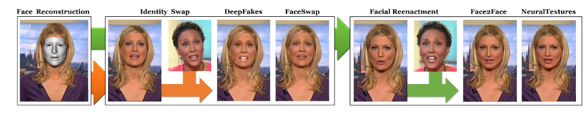

#### II. Contribution

##### 1. an automated benchmark

[link](http://kaldir.vc.in.tum.de/faceforensics_benchmark/)

##### 2. a novel large-scale dataset of manipulated facial imagery

- Data:
  - pristine data: 1,000 video sequences(containing 509,914 images) 
  - manipulated data: generated using 4 methods mentioned above 
  - ground truth masks: pixel level *fake/pristine* label for manipulated data

- Type

  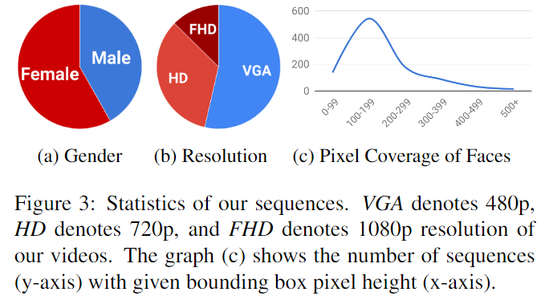

##### 3. a state-of-the-art forgery detection method tailored to facial manipulations.

- Baseline: human observation

- Best detection model: **XceptionNet + cropped face**

  - trained on 4 manipulated methods separately

    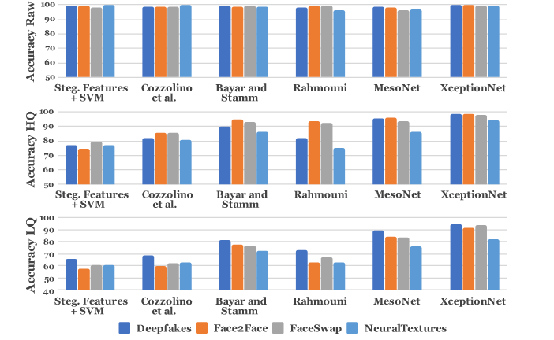

  - trained on 4 manipulated methods simultaneously

    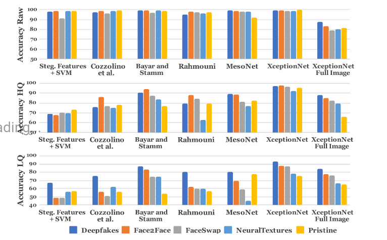

#### III. Comments

- this large dataset is useful
- we can use the benchmark to examine our method
- the detection model is straight forward and purely data-driven

------

### [AVSS 2018] Deepfake Video Detection Using Recurrent Neural Networks

- [paper](https://engineering.purdue.edu/~dgueraco/content/deepfake.pdf)

#### I. Observation

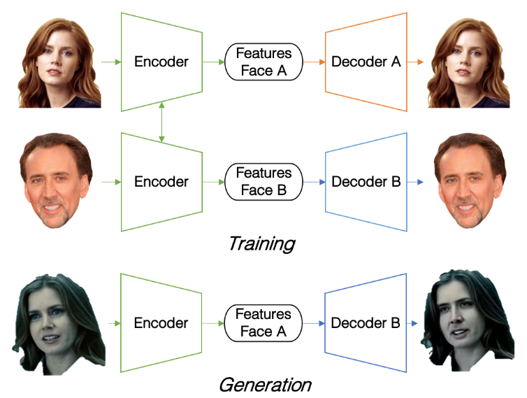

Intra-frame inconsistencies and **temporal inconsistencies** between frames are created.

1.  Multiple camera views, differences in lightning conditions or simply the use of different video codecs makes it difficult for auto-encoders to produce realistic faces under all conditions. 

   -> faces are visually inconsistent with the rest of the scene.

2. a face detector is used to extract only the face region that will be passed to the trained auto-encoder. 

   -> it is very common to have boundary effects due to a seamed fusion between the new face and the rest of the frame. 

3. the auto-encoder is used frame-by-frame and is completely unaware of any previous generated face that it may have created

   -> This lack of temporal awareness is the source of multiple anomalies. 

4. The most prominent is an inconsistent choice of illuminates between scenes with frames

   -> leads to a flickering phenomenon in the face region common to the majority of fake videos. 

#### II. Method

**CNN** (for frame feature extraction) + **LSTM** (for temporal sequence analysis)

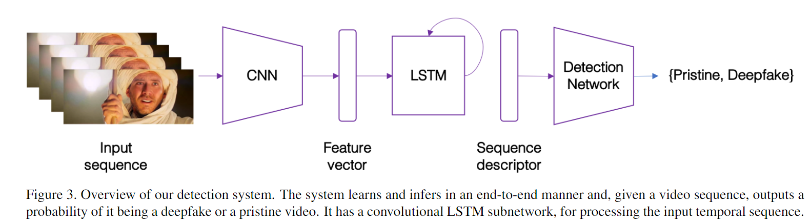

#### III. Comments

- Can LSTM capture the intro-frame inconsistencies? or this method only pays attention to temporal inconsistencies?

------

### [CVPRW 2019] Protecting World Leaders Against Deep Fakes

- [paper](http://openaccess.thecvf.com/content_CVPRW_2019/papers/Media%20Forensics/Agarwal_Protecting_World_Leaders_Against_Deep_Fakes_CVPRW_2019_paper.pdf)

#### I. Contribution

a forensic technique that is **designed to detect deep fakes of an individual.**(person specific)

#### II. Background

##### 1. 3 main categories of AI-synthesized media:

1. face-swap: the face in a video is automatically replaced with another person’s face. 
2. lip-sync: a source video is modified so that the mouth region is consistent with an arbitrary audio recording
3. puppet-master: a target person is animated (head movements, eye movements, facial expressions) by a performer

##### 2. Hypothesis

- As an individual speaks, they have **distinct (but probably not unique) facial expressions and** **movements.** 
- that the creation of all three types of deep fakes tends to disrupt these patterns 

#### III. Method

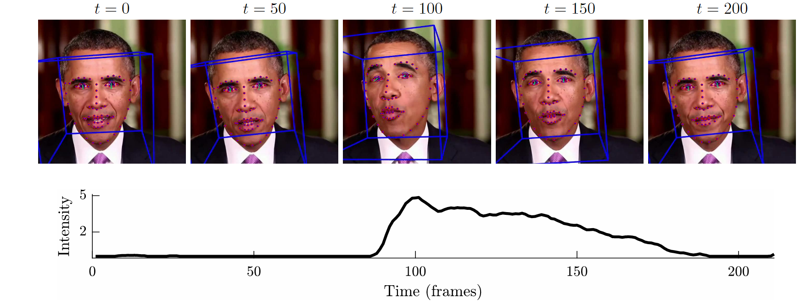

1. tracking facial and head movements and then extracting the presence and strength of specific **action units**
   - 16 AUs from OpenFace2
   - 4 AUs from hand-craft features
     - head rotation about the x-axis (pitch);
     - head rotation about the z-axis (roll); 
     - the 3D horizontal distance between the corners of the mouth 
     - the 3D vertical distance between the lower and upper lip 
   -  compute the Pearson correlation between all 20 of these features
     - 20 AUs -> 190 dim feature vector
2. build a **one-class support vector machine (SVM)** that distinguishes an individual from other individuals as well as comedic impersonators and deep-fake impersonators. 

#### IV. Comment

- this method can detect lip-sync, which is hard for FaceForensics++, shall we cover all 3 types, or just focus on some specific fakes?
- this method is person specific, can not be generally used
- why use Pearson correlation?
- how to select AU?

------

### [WIFS 2018] MesoNet: a Compact Facial Video Forgery Detection Network

- [paper](https://arxiv.org/abs/1809.00888)
- [code](https://github.com/DariusAf/MesoNet)

#### I. Observation

some flaws of forged video:

1. because of the compression of the input data on a limited encoding space, the result thus often appears a bit blurry

2. some frames can end up with no facial reenactment or with a large blurred area or a doubled facial contour.

#### II. Contribution

- exploits features at a mesoscopic level.( instaead of purely microscopic and macroscopic features )
- 2 networks for fake detection:
  - low number of parameters
  - target at Deepfakes and Face2Face

##### Meso-4

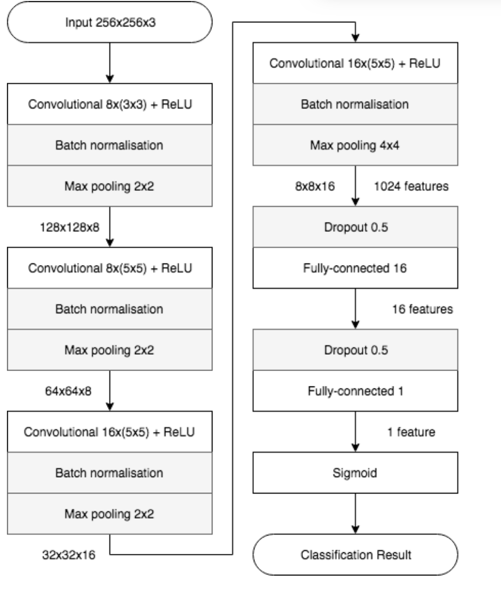

##### MesoInception-4

- replacing the first two convolutional layers of Meso-4 by a variant of the **inception module** 
  - novelty: the MesoInception block extends the Inception module with the usage of **dilated convolution** 

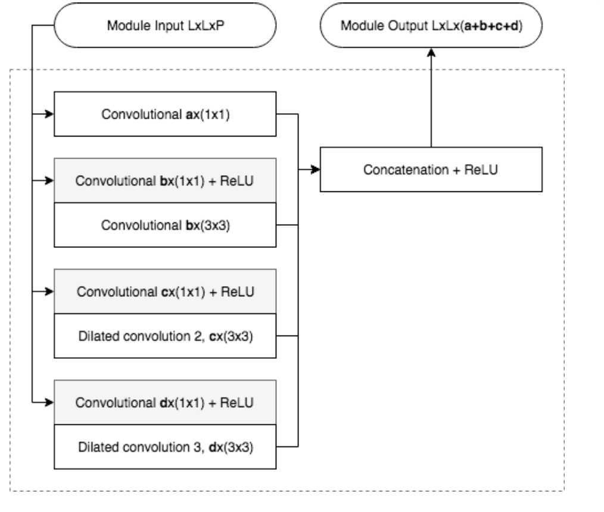

#### III. Result

- detection accuracy decreases as the video **compression level increases**
- **aggregate frame images** from a video will improve the accuracy
- the **eyes and mouth** play a paramount role in the detection of faces forged with Deep-fake.

#### IV. Comment

- will some attention layer help to guide the detector? 

------

### [CVPRW 2019] Exposing DeepFake Videos By Detecting FaceWarping Artifacts

- [paper](https://arxiv.org/abs/1811.00656)
- [code](https://github.com/danmohaha/CVPRW2019_Face_Artifacts)
- improved version: [DSP-FWA: Dual Spatial Pyramid for Exposing Face Warp Artifacts in DeepFake Videos](https://github.com/danmohaha/DSP-FWA)

#### I. Observation

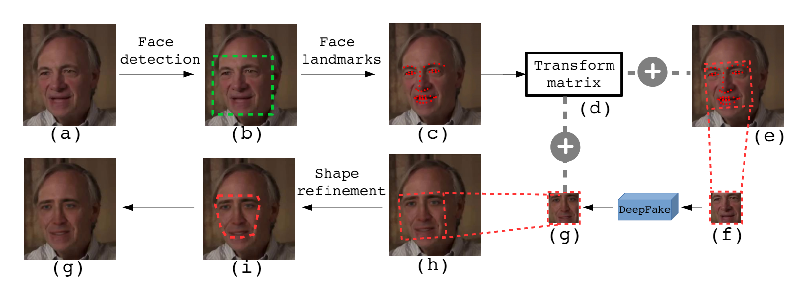

Current DeepFake algorithm can only generate images of limited resolutions, which are then needed to be further transformed to match the faces to be replaced in the source video.

-> Such transforms leave certain distinctive artifacts in the resulting DeepFake Videos

#### II. Method

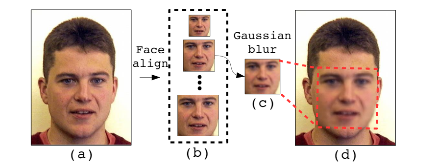

- Create negative data only use simple image processing operation, rather than using DeepFakes to produce
  - saves time
  - avoid over-fit to some generated data 
- Train 4 CNN models — VGG16, ResNet50, ResNet101 and ResNet152 using our training data. 
  - For inference, we crop the RoI of each training example by 10 times. Then we average predictions of all RoIs as the final fake probability. 

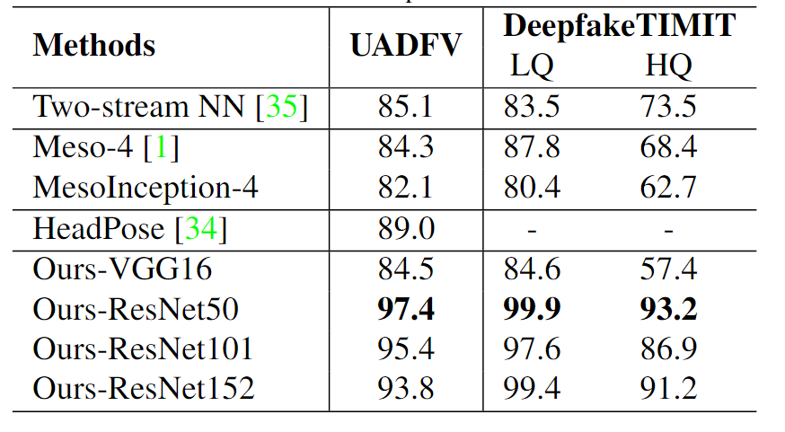

#### III. Comment

- this method targets at specific observed artifact, it might not work as the blending quality of fake techs improves

------

### [WIFS 2018] In Ictu Oculi: Exposing AI Created Fake Videos by Detecting Eye Blinking

- [paper](https://arxiv.org/abs/1806.02877)
- [code](https://github.com/danmohaha/WIFS2018_In_Ictu_Oculi)

#### I. Observation

- AI generated face lack eye blinking function, as most training datasets do not contain faces with eyes closed. The lack of eye blinking is thus a telltale sign of a video coming from a different source than a video recorder

- The general methodology we follow is to **detect the lack of physiological signals intrinsic to human beings that are not well captured in the synthesized videos**. Such signals may include spontaneous and involuntary physiological activities such as breathing, pulse and eye movement, and are oftentimes overlooked in the synthesis process of fake videos. 

#### II. Method

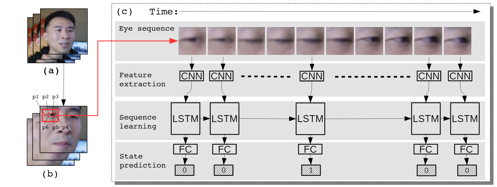

LRCN (Long-term Recurrent Convolutional Neural Networks) model:

- feature extraction -> CNN
- sequence learning -> LSTM-RNN
- state prediction -> FC

#### III. Comment

- [copy from conclusion section] 

  eye blinking is a relatively easy cue in detecting fake face videos, and sophisticated forgers can still create realistic blinking effects with post-processing and more advanced models and more training data. So in the long run, we are interested in exploring other types of physiological signals to detect fake videos. 

------

### [ICASSP 2019] EXPOSING DEEP FAKES USING INCONSISTENT HEAD POSES

- [paper](https://arxiv.org/abs/1811.00661)

#### I. Observation

Deep Fakes are created by splicing synthesized face region into the original image, and in doing so, introducing errors that can be revealed when 3D head poses are estimated from the face images. these algorithms create faces of a different person but keeping the facial expression of the original person.

-> the two faces have mismatched facial landmarks

-> This mismatch between the landmarks at center and outer contour of faked faces is revealed as **inconsistent 3D head poses** estimated from **central** and **whole** facial landmarks

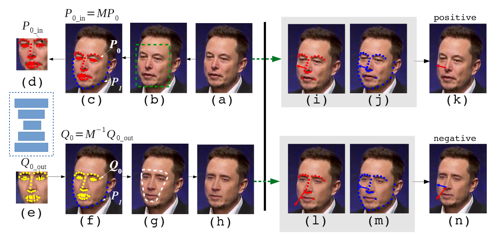

### II. Method

1. Detect 68 facial landmarks use DLib

   

2. calculate the head poses from central face region and whole face  respectively.

3. calculate the head pose difference (there are several metrics, different metrics can lead to different accuracy)

   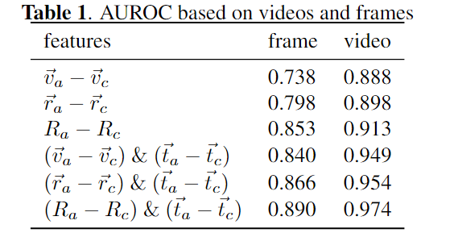

4. train a SVM classifier based on the difference

### III. Comment

- useful cue: the two faces have mismatched facial landmarks
- can we detect the landmark mismatch directly?

------

### [CVPR 2019] Recurrent Convolutional Strategies for Face Manipulation Detection in Videos

- [paper](https://arxiv.org/abs/1905.00582)

#### I. Observation

face manipulation generation tools do not enforce temporal coherence in the synthesis process and perform manipulations on a frame-by-frame basis

-> leverage temporal artifacts as a means for indication of abnormal faces in a video stream

#### II. Method

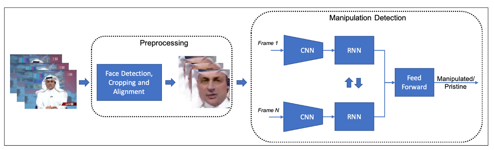

crop&aligned faces -> CNN(extract features) -> bidirectional RNN -> fake/pristine

- novelty:
  - utilize face alignment as a means for removing confounding factors in detecting facial manipulations, instead of the use whole frame
  - make use of bidirectional recurrency rather than just mono-directional.

#### III. Result

- for CNN: DenseNet outperforms ResNet
- face alignment to give improvement
- a sequence of images to be better than single frame input. 
- bidirectional recurrence to be superior to uni-directional recurrence. 
- landmark-based alignment is better than STN-based
- multi-recurrence model failed might due to over-fit to small datasets

#### IV. Comment

- another CNN+RNN method
- maybe useful observation of artifacts:
  1. subtle inconsistency in the hairs — too straight, with disconnected strands or simply unnatural
  2. unnaturally asymmetric face
  3. weird teeth
  4. other more clear inconsistencies are not localized on the face yet in the back-ground. 
  5. temporal inconsistency

------

### [arXiv 2018] ForensicTransfer: Weakly-supervised Domain Adaptation for Forgery Detection

- [paper](https://arxiv.org/abs/1812.02510)

#### I. Observation

- Current learning based detecting method tend to overfit to specific manipulation that the detector are trained on (eg. detector trained on Face2Face might fail on FaceSwap or some unseen methods)
- ForensicTransfer tackles the problem of detecting novel unseen manipulation methods, without the need of a large amount of training data. 

#### II. Method

- **core idea**: disentangle the knowledge that we can gain from training on a source domain into the knowledge about fake and real imagery. 
- architecture: auto-encoder

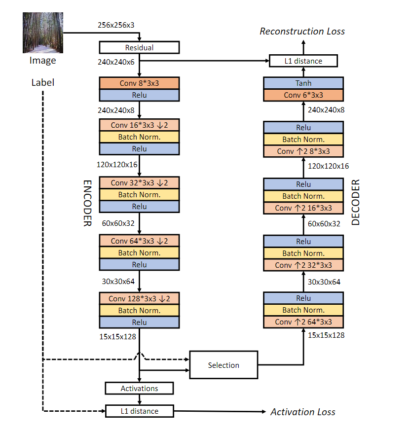

- input image -> [Encoder] -> **Forensic Embedding** -> [Decoder] -> reconstructed image
  - Forensic Embedding latent vector
    - activation loss
    - the forgery detection is based on the activation of the latent space partitions. 

#### III. Result

- Transferability

  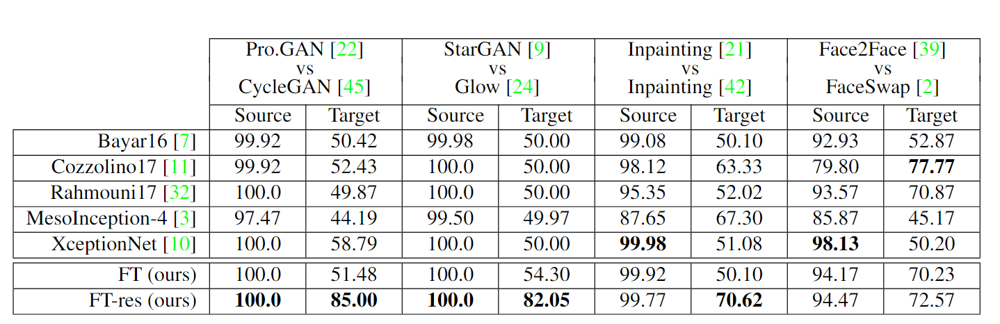

#### IV. Comment

- adapt transfer to deal with different method
- does it really work?

------

### [ISITC 2018] Forensics Face Detection From GANs Using Convolutional Neural Network

- [paper](https://www.researchgate.net/publication/328744832_Forensics_Face_Detection_From_GANs_Using_Convolutional_Neural_Network)

#### I. Method

- contribution: a deep convolutional neural  network for detecting real/fake image **from GANs.** 

- model:  based on face recognition networks

  - structure: VGGFace + 2-way FN

  - performance: 

    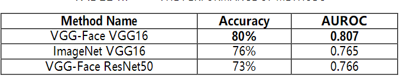

#### II. Comment

- not based on observed artifacts, purely data-driven
- VGGFace for feature extraction

------

### [Expert Systems With Applications 2019] Face image manipulation detection based on a convolutional neural network

- [paper](https://www.sciencedirect.com/science/article/pii/S0957417419302350)

#### I. Contribution

1. A proposal of a large manipulated face dataset which was collected and validated manually. 
2.  A proposal of MANFA and HF-MANFA models to effectively classify manipulated face dataset.
3. The state-of-the-art performance on the imbalanced dataset is achieved by using the proposed HF-MANFA model. 
4. The integration of an ensemble approach into MANFA model brings a robust performance on various imbalanced dataset scenarios. 
5. The proposed model outperforms existing models in detecting manipulated face region. 

#### II. Method

##### MANFA

a customized convolutional neural network model for Manipulated Face (MANFA) identification

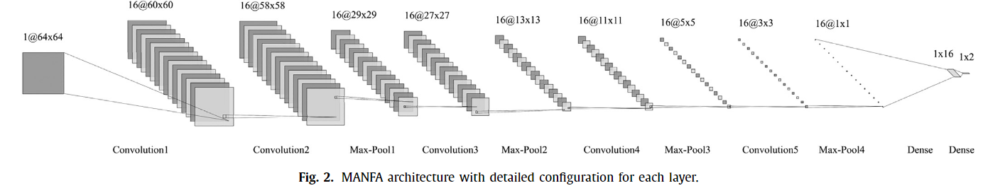

5 Conv, 4 MaxPooling, 2 FC

##### HF-MANFA

A hybrid framework (HF-MANFA) that uses Adaptive Boosting (AdaBoost) and eXtreme Gradient Boosting (XGBoost) to deal with the imbalanced dataset challenge.

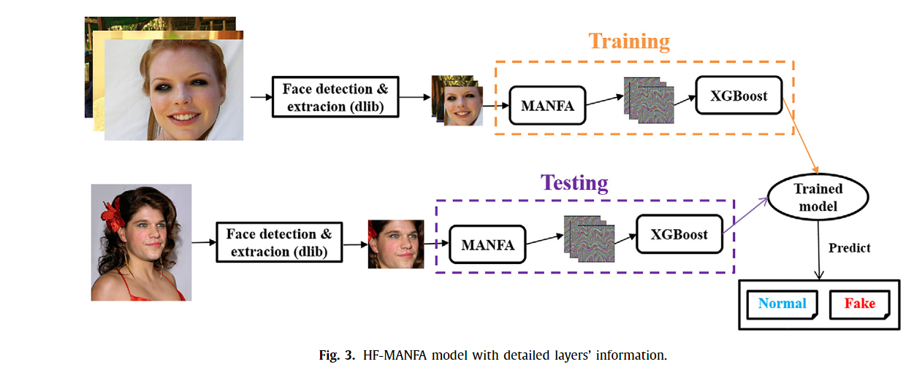

#### III. Result

-  In this balanced dataset experiment, XGB- VGGFace achieved the highest accuracy and AUC. 
- class-weight approach can solve the class imbalanced issue. 
- However, ADA-VGGFace and especially XGB-VGGFace performed even better with AUC values of 0.911 and 0.936, respectively whereas XGB-MANFA achieved the highest AUC of 0.944. 

#### IV. Dataset

[MANFA dataset & Swapme and FaceSwap dataset](https://www.sciencedirect.com/science/article/pii/S0957417419302350?via%3Dihub)

##### V. Comment

future issues mentioned in Conclusion Sec.

1. Instead of focusing only on extracting features from RGB colour channel, it would be better if we consider potential features when a manipulated image is exposed under other channels or environments.
2. it is worth applying several pre-processing techniques, such as image whitening transformation, augmentation to increase the model performance.
3. recent models achieved the state-of-the-art performance on detecting manipulated face image. However, it fails to detect image generated entirely by GAN
4. the proposed model only detected face image manipulation without localizing manipulated regions

my thoughts:

- VGGFace again is proved efficient in extracting face feature
- Gradient boosting for the imbalanced data problem

------

### [ICASSP 2019] Capsule-forensics: Using Capsule Networks to Detect Forged Images and Videos

- paper: [v1](https://www.semanticscholar.org/paper/Capsule-forensics%3A-Using-Capsule-Networks-to-Detect-Nguyen-Yamagishi/445def496333e92ac9d7beeb5168a905f7449c4c);[v2](https://arxiv.org/abs/1910.12467)
- code: [v1](https://github.com/nii-yamagishilab/Capsule-Forensics);[v2](https://github.com/nii-yamagishilab/Capsule-Forensics-v2)

#### I. Contribution

- a **capsule network** that can detect **various kinds of  attacks,** from presentation attacks using printed images and replayed videos to attacks using fake videos created using deep learning.  
  - It uses many fewer parameters than traditional convolutional neural networks with similar performance.  
  - the 1st application of capsule networks to the forensics problem through detailed analysis and visualization

#### II. Method

- pipeline:

  - image -> [face extracting & align] -> [VGG19] -> features -> [Capsule Network] -> fake/pristine

    

- Capsule-Forensics 

  - architecture

    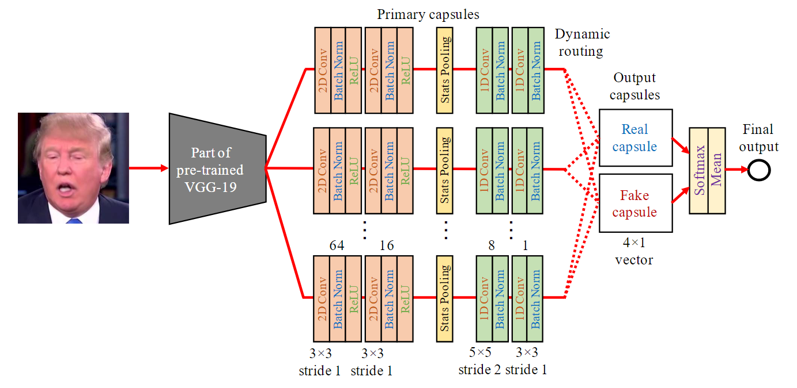

  - dynamic routing algorithm

    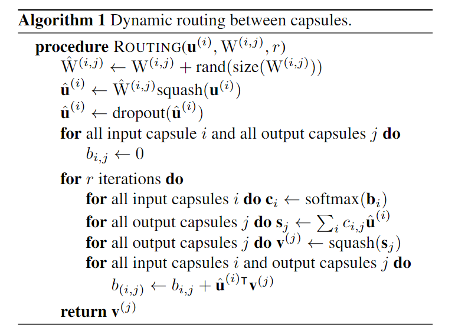

    - add Gausian random noise
    - add addition squash

#### III. Result

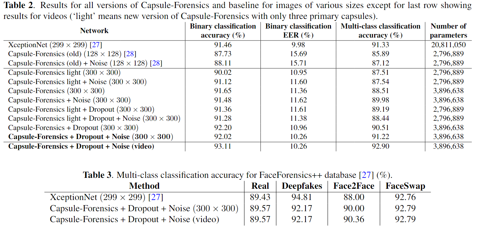

#### IV. Comment

- general detection
- capsule network
- VGG again for feature extraction

------

### [CVPRW 2017] Two-Stream Neural Networks for Tampered Face Detection

- [paper](https://www.semanticscholar.org/paper/Two-Stream-Neural-Networks-for-Tampered-Face-Zhou-Han/5c04b3178af0cc5f367c833030c118701c210229#paper-header)

#### I. Contribution

1. a two-stream network for face tampering detection.
   - GoogleNet and the triplet network as a two-stream network architecture
   - learns both tampering artifacts and local noise residual features
2. a new dataset specific to dace region tampering detection

#### II. Method

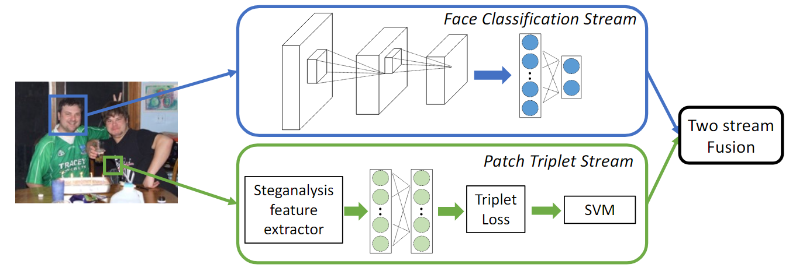

two stream framework:

- face classification stream
  - a CNN trained to classify whether a face image is tampered or authentic.

  - learns the artifacts created by the tampering process. 

- patch triplet stream

  - trained on steganalysis features of image patches with a triplet loss
  - models the traces left by in-camera processing and local noise characteristics. 

#### III. SwapMe and FaceSwap Dataset

#### IV. Comment

- fused method
- will steganalysis features still appears in faked data in the future?
- not end-to-end

------

### [arXiv 2019] FakeCatcher: Detection of Synthetic Portrait Videos using Biological Signals

- [paper](https://arxiv.org/abs/1901.02212)

#### I. Observation

- current detectors **blindly** utilizing deep learning are not effective in catching fake content, and are limited by the specific generative model, dataset, people, or hand-crafted features. 
- key assertion: **biological signals** hidden in portrait videos can be used as an implicit descriptor of authenticity, because they are **neither spatially nor temporally preserved** in fake content. 

#### II. Biological Signal Analysis on Fake & Authentic Video Pairs

- employ the following six signals: 
  $$
  S = \{G_l;G_r;G_m;C_l;C_r;C_m\}
  $$
  that are combinations of G channel-based **PPG** (robust against compression artifacts) and chrominance-based PPG

- analyzing signals in time domain and in frequency domain. 

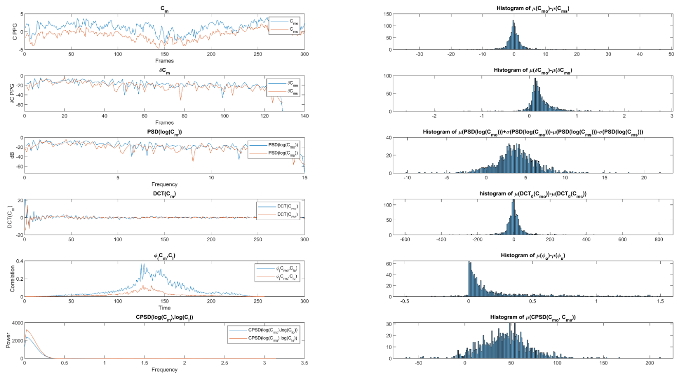

#### III. Generalized Authentic Content Classifier

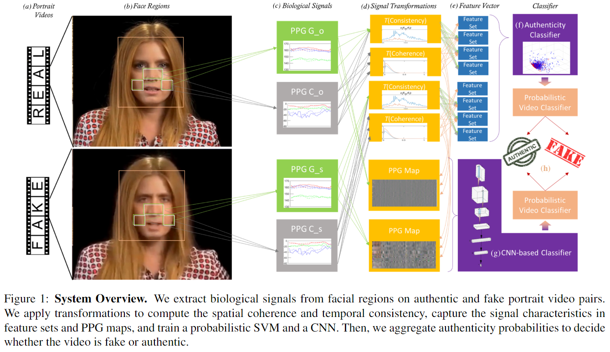

##### Authenticity Classification

- based on bio-signal features observed on time and frequency domain

- SVM + RBF kernel

  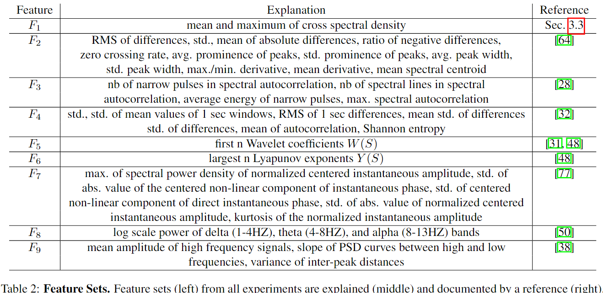

##### CNN-based Classification 

- based on PPG Map

  - initial map
    -  we map the non-rectangular ROI for $C_m$into a rectangular one using Delaunay Triangulation
    - divide the rectangular image into 32 same size sub-regions. For each of these sub-regions, we calculate a local $C_m$ and normalize them to [0;255] interval.
    - combine these values for each sub-region within $w$ frame window into an $w*32$ image, called PPG map, where each row holds one sub-region and each column holds one frame.
  - spectral map
    - enhance our PPG maps with the addition of encoding binned power spectral densities from each sub-region, creating $w*64$ size images. 

  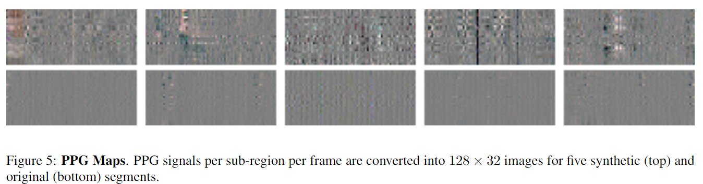

- CNN-based classification

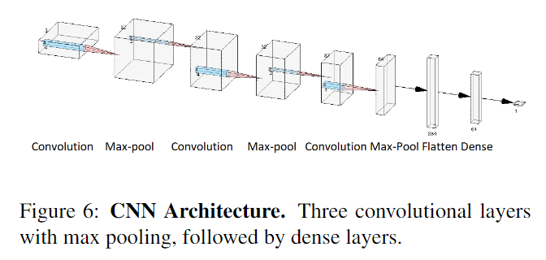

#### IV. Deep Fakes Dataset

more ''in the wild" portrait videos

#### V. Result

- performance

  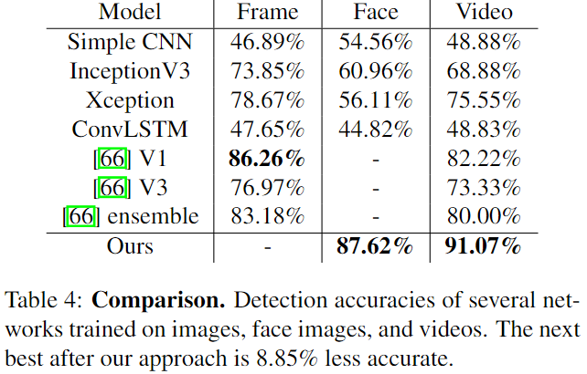

- findings

  1. Spatial coherence: Biological signals are not coherently preserved in different synthetic facial parts. 
  2. Temporal consistency: Synthetic content does not contain frames with stable PPG.
  3. Combined artifacts: Spatial inconsistency is augmented by temporal incoherence
  4. Artifacts as features: These artifacts can be captured in explainable features by transforming biological signals. However there is no clear separation or reduction of the feature sets into lower dimensions, thus CNN classification performs better than SVM classification. 
  5. Comprehensive analysis: Finally, our classifier has higher accuracy for detection in the wild, for shorter videos, and for mid-size ROIs.

#### VI. Comment

- utilize bio-signal
- signal transfrom in time and frequency domain
- useful findings and analysis, we can take it as reference

------

### [CVPR 2019] **ManTraNet**: Manipulation Tracing Network For Detection And Localization of Image Forgeries With Anomalous Features

- [paper](http://openaccess.thecvf.com/content_CVPR_2019/html/Wu_ManTra-Net_Manipulation_Tracing_Network_for_Detection_and_Localization_of_Image_CVPR_2019_paper.html)
- [code](https://github.com/ISICV/ManTraNet)

#### I. Observation

limitation of current method:

- not capable of handling more complicated and/or unknown types.
- only focus on image-level detection, overlooked forgery region localization. [image forgery localization/detection (IFLD)].

#### II. Method

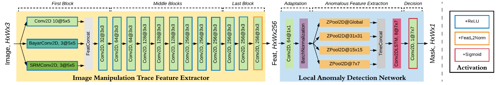

a unified deep neural architecture called ManTra-Net. 

- a simple yet effective self-supervised learning task to learn robust image manipulation traces from classifying 385 image manipulation types. 
- formulate the forgery localization problem as a local anomaly detection problem, design a Z-score feature to capture local anomaly, and propose a novel long short-term memory solution to assess local anomalies.

##### Image Manipulation-Trace Feature Extractor

- backbone network: VGG (better than ResNet, DnCNN)
- feature choice of 1st layer: Combined (SRMConv2D, BayarConv2D, Conv2D)
- fine-grained manipulation type: 
  - break down current 7 families to different hierarchies for 7, 25, 49, 96, 185, and 385 classes for manipulation classification.
  - fine-grained manipulation classes help improve accuracy
- the proposed IMC feature is useful for the IFLD task;

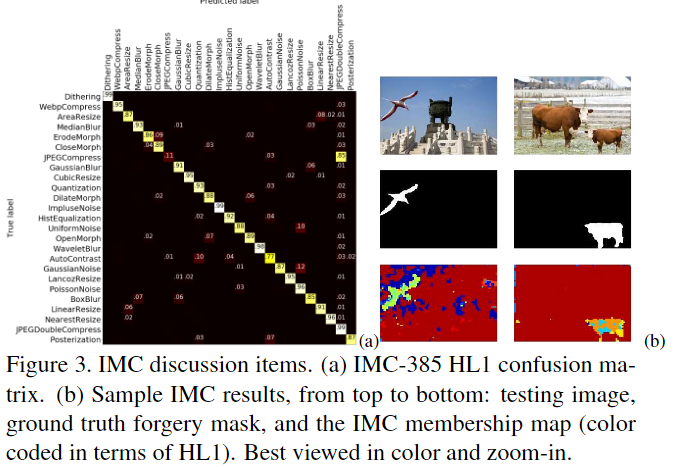

#####  Local Anomaly Detection Network 

Anomalous Feature Extraction

- compute feature: Z-score features w.r.t. different window size
- quantify difference: concatenate Z-score features along the new artificial time dimension and produce a 4D feature of size (k+1)×H×W×L.
  - ConvLSTM2D layer
  - analyzes the Z-score deviation belonging to different window sizes in a sequential order. 
  - conceptually mimics the far-to-near analysis. 

#### IV. Comment

- forensics localization
- detect local anomaly be quantify local feature difference in different scale
- image manipulation trace feature
- different scale + sequential analyze -> mimic  "far-to-near" analysis

------

### [arXiv 2019] Celeb-DF: A New Dataset for DeepFake Forensics

- [paper](https://arxiv.org/abs/1909.12962)

#### I. Observation

- Existing dataset of DeepFake videos suffer from low visual quality and abundant artifacts that do not reflect the reality of DeepFake videos circulated on the Internet.

#### II. Celeb-DF Dataset

- [link](http://www.cs.albany.edu/~lsw/celeb-deepfakeforensics.html)

- example

  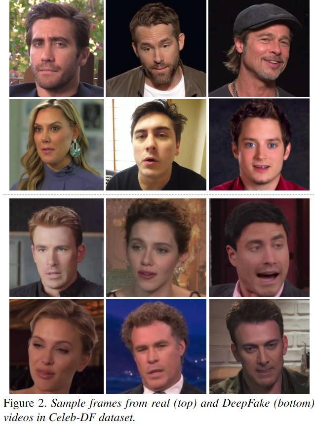

- benchmark

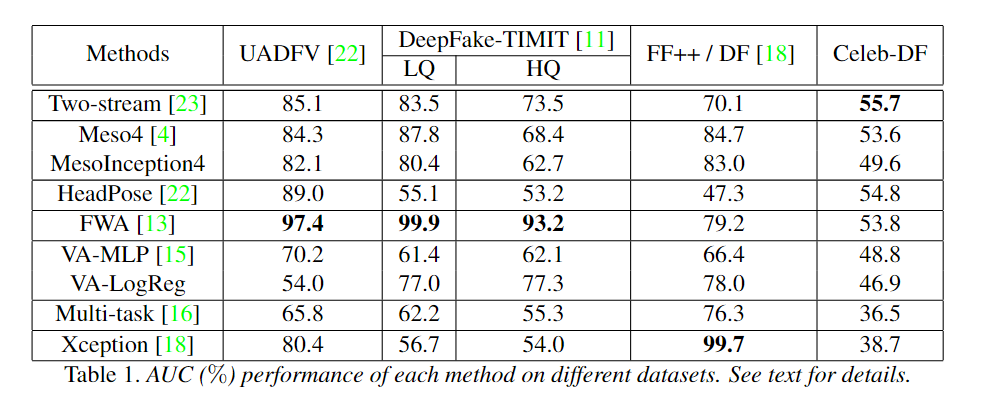

------

### [BTAS 2019] Multi-task Learning for Detecting and Segmenting Manipulated Facial Images and Videos

- [paper](https://arxiv.org/abs/1906.06876)
- [code](https://github.com/nii-yamagishilab/ClassNSeg)

#### I. Method

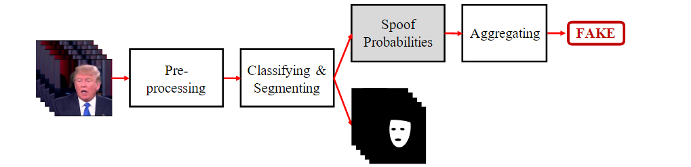

 a multi-task learning approach

- classification: real/fake
- segmentation:  locating manipulated regions in images 

#### II. Model

- Y-shape Auto-encoder
  - 3 types of loss: activation loss, segmentation loss, and reconstruction loss
  - 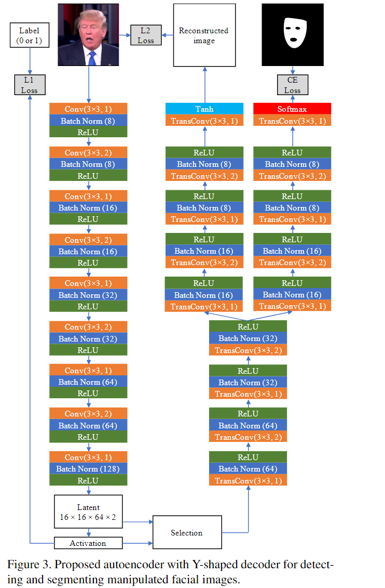

- result

  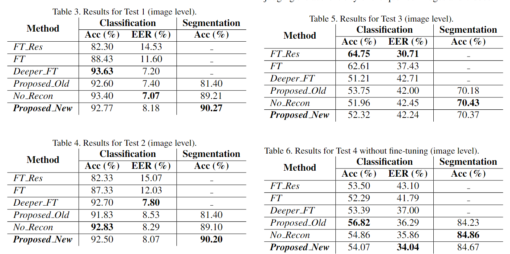

#### III. Comment

- similar to ForensicTransfer
- the localization of manipulated region

------

### [WACVW 2019] Exploiting Visual Artifacts to Expose Deepfakes and Face Manipulations

- [paper](https://www.semanticscholar.org/paper/Exploiting-Visual-Artifacts-to-Expose-Deepfakes-and-Matern-Riess/3a8939eade51aac810ec89e4b661a7760f31357e#citing-papers)
- [code](https://github.com/FalkoMatern/Exploiting-Visual-Artifacts) 

#### I. Observation

- Generated face
  - method: ProGAN, Glow
  - artifact: lack global consistency
    - high variance in color between the left and right eyes
- Manipulation of facial attributes
  - method: Face2Face
  - artifact: 
    - shading around nose
    - artifacts along boundary of the face mask
- Deepfakes
  - method: face swapping
  -  artifact:
    - missing specular reflection in the eyes
    - missing details in teeth and eye areas

#### II. Method

detect each manipulation method according to corresponding artifacts

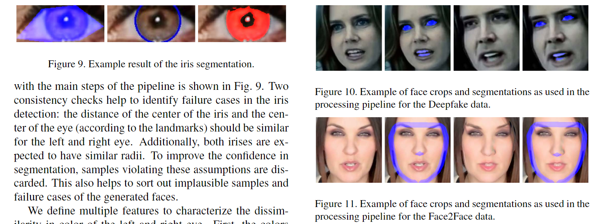

- generated face:
  - model the dissimilarity in color of the left/right eyes as feature vector
  - k-NN classifier
- deepfakes
  - adopt texture energy approach to generated features describing the complexity in eye and teeth area
  - 3*FC + ReLU
- face2face
  - features for face border and nose tip

#### III. Comment

- so bad generality

------

### [TIFS 2019] Attention-Based Two-Stream Convolutional Networks for Face Spoofing Detection

- [paper](https://ieeexplore.ieee.org/document/8737949)

#### I. Observation

- the performance of many existing methods is degraded by illuminations. 

- the MSR algorithm can be regarded as an optimized high pass filter, thus it can effectively preserve the high frequency components which is discriminative between the real and fake faces. 

- 2 complementary information

  - RGB:  contains the detailed facial information yet is sensitive to illumination

  - MSR: invariant to illumination yet contains less detailed facial information

#### II. Method

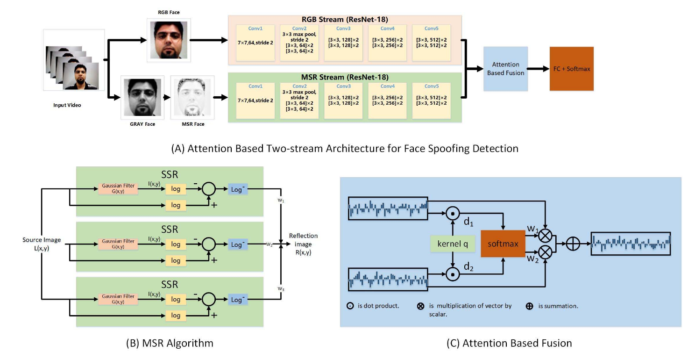

Two Stream Convolutional Neural Network (TSCNN) 

- RGB & MSR stream
- Attention based fusion

#### III. Comment

- MSR
- attention 

------

### [arXiv 2019] Unmasking DeepFakes with simple Features

- [paper](https://arxiv.org/abs/1911.00686)
- [code](https://github.com/cc-hpc-itwm/DeepFakeDetection)

#### I. Observation

- real and fake images behave in noticeable different spectra **at high frequencies**, and therefore they can be easily classified. 

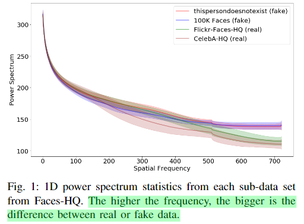

#### II. Method

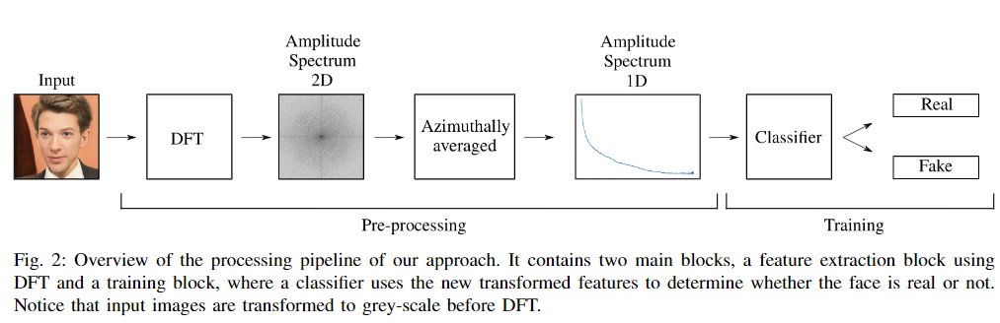

- step 1: Frequency Domain Analysis  
  - image -> [Discrete Fourier Transform] ->  sinusoidal components of various frequencies -> [ Azimuthal Average ] -> 1D representation of FFT power spectrum
- step 2: Classification
  -  Logistic Regression 
  -  Support Vector Machines (SVM)
  -  K-Means Clustering 

#### III. Experiment

- the impact of different frequency components

  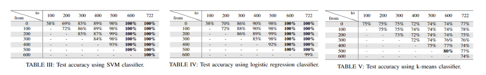

-  deepfake images have a noticeably different frequency characteristic.  

  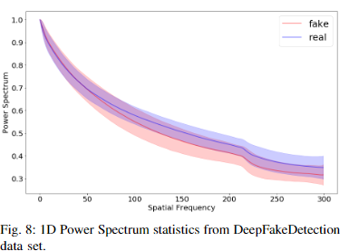

  - PS: the standard deviations from the real and the deepfake statistics overlap with each other, meaning that **some samples will be misclassified**. (the accuracy is not satisfying)

#### IV. Comment

- do not dig deep into the reason behind the phenomenon
- another feature->classification method
- frequency domain