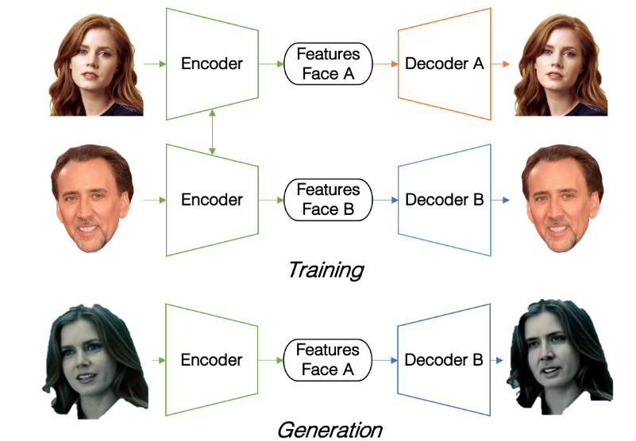
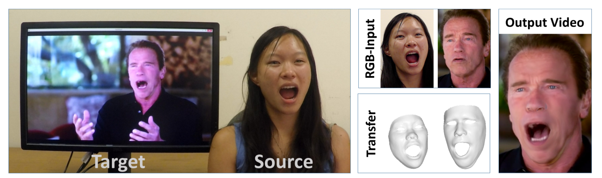
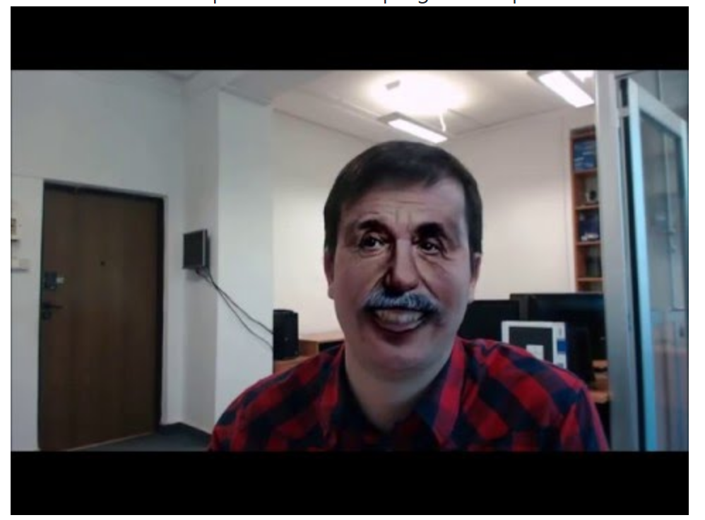
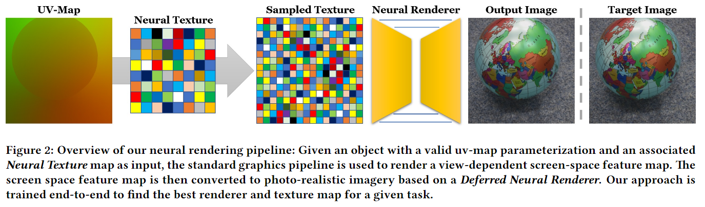
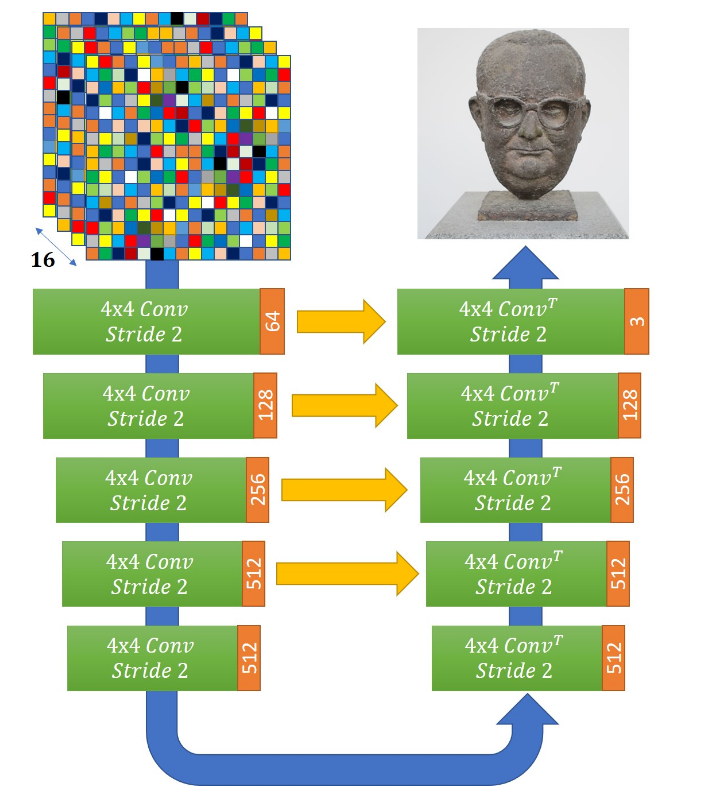
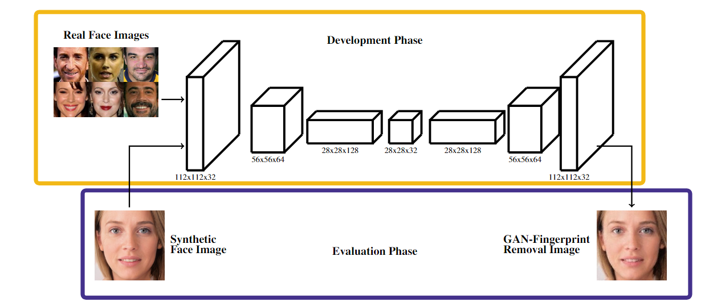
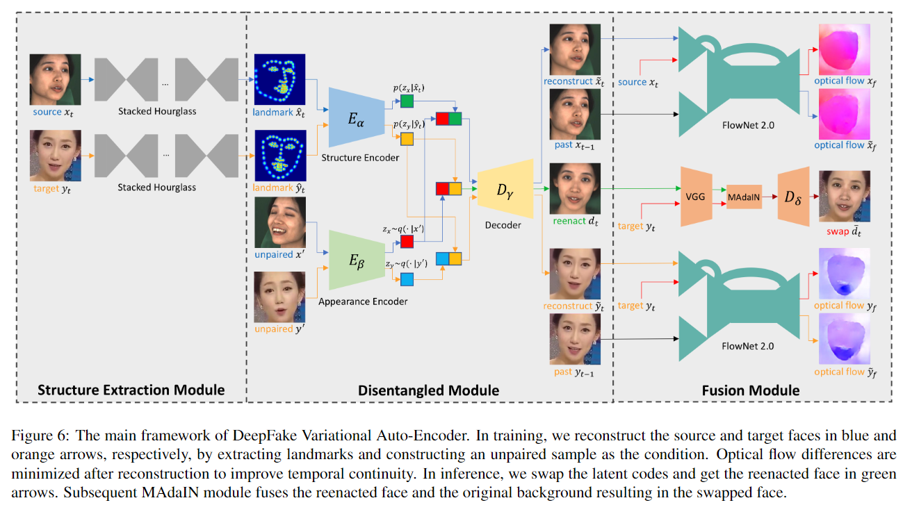

# Fake method

### DeepFakes

- [project](https://github.com/deepfakes/faceswap)
- [deepfacelab](https://www.deepfakescn.com/?p=889)

#### I. Method

- **core idea**: training 2 auto-encoder(Encoder+Decoder)
  - Encoder: perform a dimension reduction by encoding the data from the input layer into a reduced number of variables.
  - Decoder: use encoded variables to output an approximation of the original input. 
- **trick**:  sharing the weights of the encoding part of the two auto-encoders, but keeping their respective decoder separated
  - force encoder to encode general information of illumination, position and expression of the face
  - dedicate decoder for each person to reconstitute constant characteristic shapes and face details

#### II. Flaw

- the extraction of faces and their reintegration can fail, especially in the case of face occlusions 

  -> some frames can 

  - end up with no facial reenactment 
  - with a large blurred area 
  - with a doubled facial contour

- auto-encoders tend to poorly reconstruct fine details because of the compression of the input data on a limited encoding space

  -> the result thus often appears a bit blurry

-  the algorithm can only synthesize face images of a fixed size, and they must undergo an affine warping to match the configuration of the source’s face. 

  -> This warping leaves distinct artifacts due to the resolution inconsistency between warped face area and surrounding context

------

### [CVPR 2016] Face2Face

- [project](https://web.stanford.edu/~zollhoef/papers/CVPR2016_Face2Face/page.html)
- [paper](https://web.stanford.edu/~zollhoef/papers/CVPR2016_Face2Face/paper.pdf)

Our goal is to animate the facial expressions of the target video by a source actor and re-render the manipulated output video in a photo-realistic fashion. 

#### I. Method

- dense, global non-rigid model-based bundling(a multi-linear parameterized PCA model)
- accurate tracking, appearance, and lighting estimation in unconstrained live RGB video
- person-dependent  expression  transfer  using  sub space deformations
- a novel mouth synthesis approach.

#### II. Flaw

- The assumption of Lambertian surfaces and smooth illumination is limiting

  -> may lead to artifacts in the presence  of  hard  shadows or specular highlights

- Scenes with face occlusions by long hair and a beard are challenging

- only reconstruct and track a low-dimensional blend shape model (76 expression coefficients), -> omits fine-scale static and transient surface details

- On a too short sequence, or when the target remains static, we cannot learn the person-specific mouth behavior.

  -> In this case, temporal aliasing can be observed, as the target space of the retrieved mouth samples is too sparse

------

### FaceSwap

- [project](https://github.com/MarekKowalski/FaceSwap/)

#### I. Method

CG based method: 

0. do some face detect and model fitting on src face image to get the corresponding mapping with the src image as texture

1. The face region is detected and the facial landmarks are located.
2. The 3D models is fitted to the located landmarks.
3. The 3D models is rendered using pygame with the texture obtained during initialization.
4. The image of the rendered model is blended with the image obtained from the camera using feathering (alpha blending) and very simple color correction.
5. The final image is shown to the user.

------

### [SIGGRAPH 2019] Neural Textures

- [project](https://niessnerlab.org/projects/thies2019neural.html)
- [paper](https://arxiv.org/pdf/1904.12356)

#### I. Method

- Neural Textures 

  - are an extension of traditional texture (like normal/color texture map) 
  - instead of storing low-dimensional hand-crafted features, they store **learned high-dimensional feature maps** capable of storing significantly more information and can be interpreted by new deferred neural rendering pipeline
  - can be interpolated
  - can be stacked by Laplacian Pyramid to improve rendering quality
  - [H, W, 16] (can force the first 3 channels to represent average color by some intermediate loss)

- Deferred Neural Renderer

  - use traditional CG pipeline to render coarse 3D proxy, which is textured with neural texture, to get the space feature map

  - use defer neural renderer to render the space feature map to photo-realistic image

  - U-Net architecture:

    

------

### [arXiv 2019] Real or Fake? Spoofing State-Of-The-Art Face Synthesis Detection Systems

- [paper](https://arxiv.org/abs/1911.05351?utm_source=wechat_session&utm_medium=social&utm_oi=621306384155807744)

#### I. 4 categories of face image manipulation

- entire face synthesis (mainly GANs, eg. StyleGAN)
- face swapping/identity swap (FaceSwap, DeepFakes, etc.)
- facial attributes
- facial expression (Face2Face)

#### II. GAN-fingerprint removal approach

- core idea: the auto-encoder can act as a GAN-fingerprint removal 

  system. 

  - as Encoder encode input image to a low-dimensional feature vector, for a reduced size of the latent feature representation vector, it will be forced to encode **only the most discriminative information.** 

- method:

  - train: use only real face image
  - eval: pass synthetic image as input, the reconstructed image will be fingerprint-removed

#### III. Experiment on state-of-the-art detection method

1. the existing systems attain almost perfect performance when the evaluation data is derived from the same source used in the training phase, which suggests that these systems have actually learned the GAN fingerprints; 
2. the observed performance decreases substantially (by up to ten times) when the methods are exposed to **data from unseen databases**, and over seven times if the **image resolution is substantially reduced**;
3. the accuracy of the existing methods also drops significantly when analyzing synthetic data manipulated by the fingerprint-remove approach

conclusion

- the existing facial fake detection methods still have a poor generalization capability and are highly susceptible to - even simple - image transformation manipulations

#### IV. Dataset - FSRemovalDB

A novel database named Face Synthesis Removal (FSRemovalDB) produced after applying our proposed GAN-fingerprint removal approach to original synthetic images 

[link]( https://github.com/BiDAlab/FSRemovalDB )

------

### [arXiv 2020] DeepFake Variational Auto-Encoder (DF-VAE)

- [arXiv 2020] [DeeperForensics-1.0: A Large-Scale Dataset for Real-World Face Forgery Detection](https://arxiv.org/abs/2001.03024)

#### Method

#####  Disentanglement of structure and appearance

For robust and scalable face reenactment, we should cleanly disentan-gle **structure** (i.e., expression and pose) and **appearance** rep-resentation (i.e., texture, skin color, etc.) of a face. 

1. use the stacked hourglass networks to extract landmarks of $x_t$ in the structure extraction module and get the heat-map.
2. Then we feed the heat-map to the Structure Encoder, and another source face to the Appearance Encoder .
3. We concatenate the latent representations (small cubes in red and green) and feed it to the Decoder
4. Finally, we get the reconstructed face 

#####  Style matching and fusion

masked adaptive instance normalization (**MAdaIN**) module

- We place a typical **AdaIN** network after the reenacted face.
- In the face swapping scenario, we only need to adjust the style of the face area and use the original back-ground. Therefore, we use a mask mt to guide AdaIN network to focus on style matching of the face area.

 ##### Temporal consistency constraint 

- Temporal discontinuity of fake videos leads to obvious flickering of the face area
- In order to build the relationship between a current frame and previous ones, we further make an intuitive assumption that the **optical flows should remain unchanged** after recon-struction.
  -  FlowNet 2.0  
  - we minimize the difference between ~ xf and xf to improve temporal continuity while keeping stable facial detail generation